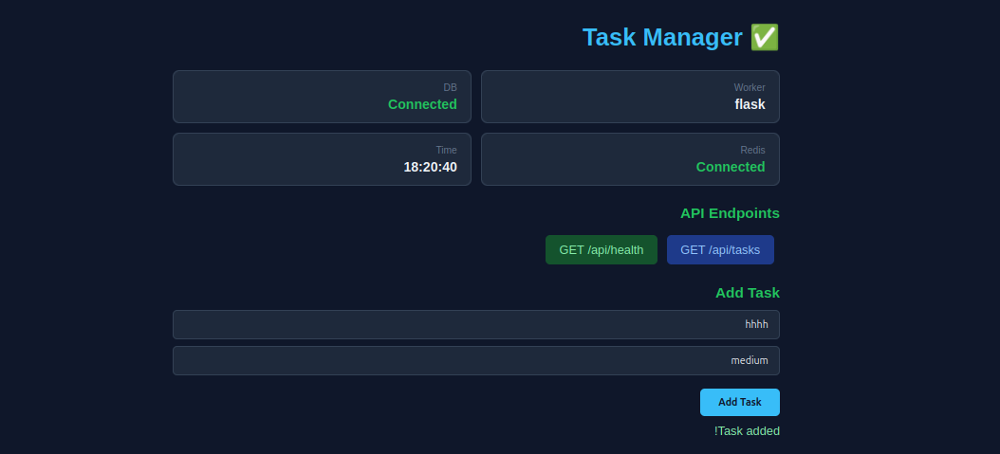

# Docker Task Manager

A containerized task management system built with DevOps best practices.

## 🚀 Technologies

- Flask
- PostgreSQL
- Redis
- Docker
- Docker Compose

## ✨ Features

✔ Add tasks  
✔ View tasks  
✔ Mark tasks as done  
✔ Database integration  
✔ Redis caching  
✔ Containerized architecture

## 📦 How to Run

```bash
docker compose up --build

